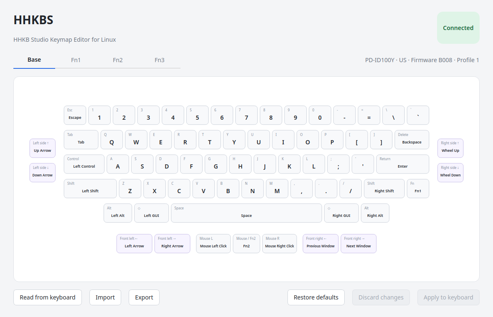

# HHKBS — HHKB Studio Keymap Editor for Linux

HHKBS is an unofficial visual keymap editor for the US-layout HHKB Studio on Linux. It reads the active profile and lets you edit keys, layers, mouse buttons, and gesture pads.

HHKBS is an independent project and is not affiliated with or endorsed by PFU Limited.



## Features

- automatic HHKB Studio discovery and profile reading
- visual editing of Base, Fn1, Fn2, and Fn3
- mouse-button and gesture-pad editing
- searchable key and device-function assignments
- TOML profile import and export
- US Profile 1 default restoration

## Current status

Writing profiles to the keyboard is not available yet. Editing, importing, restoring defaults, and exporting only change the profile in memory.

## Build and run

Install the build dependencies on Ubuntu:

```bash
sudo apt install build-essential cmake qt6-base-dev
```

Build and start HHKBS:

```bash
cmake -S . -B build -DCMAKE_BUILD_TYPE=Release
cmake --build build --parallel
./build/hhkbs
```

## Device permissions

If HHKBS reports a permission error, install the included udev rule and reconnect the keyboard:

```bash
sudo install -m 0644 packaging/60-hhkbs.rules /etc/udev/rules.d/60-hhkbs.rules
sudo udevadm control --reload-rules
sudo udevadm trigger
```

Run HHKBS as your normal user, not with `sudo`.

## Usage

1. Connect the HHKB Studio over USB and start HHKBS.
2. Select Base, Fn1, Fn2, or Fn3.
3. Select a key, mouse button, or gesture-pad direction and assign a function.
4. Export the edited profile as TOML.

**Restore defaults** loads the US Profile 1 defaults into the editor. **Discard changes** returns to the profile most recently read or imported. Neither action writes to the keyboard.
