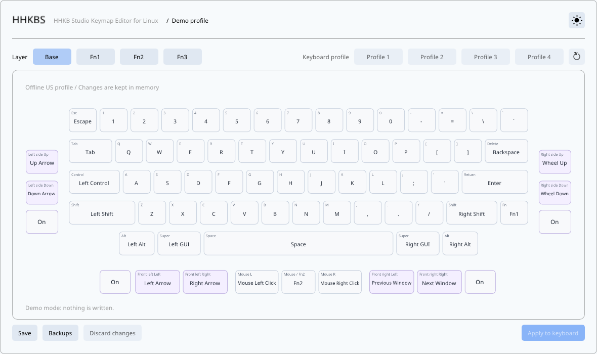

# HHKBS

Unofficial HHKB Studio keymap editor for the US layout on Linux.

<picture>
  <source media="(prefers-color-scheme: dark)" srcset="docs/images/hhkbs-main-dark.png">
  
</picture>

## Download

Release builds will be available on [GitHub Releases](https://github.com/07LEE/hhkbs/releases).

## Device permissions

If HHKBS reports a permission error, download [60-hhkbs.rules](packaging/60-hhkbs.rules). Run these commands from the folder containing the downloaded file, then reconnect the keyboard:

```bash
sudo install -m 0644 60-hhkbs.rules /etc/udev/rules.d/60-hhkbs.rules
sudo udevadm control --reload-rules
sudo udevadm trigger
```

## Usage

1. Connect the HHKB Studio over USB and open HHKBS.
2. Choose a profile (1 to 4) and a layer (Base, Fn1, Fn2, or Fn3).
3. Select a key, mouse button, or gesture-pad direction and assign a function.
4. Choose Apply to keyboard, or Export to save the profile as TOML.

Each gesture pad has an On/Off button beside it. HHKBS reads the state from the keyboard and switches it right away; this takes effect immediately and is not part of the profile. The button follows the keyboard when a pad is switched with a Pad On, Off or Toggle key.

Apply saves the profile currently on the keyboard to `~/.local/state/hhkbs/backups/` before writing. Backups lists them so one can be restored. Do not unplug the keyboard while it is being written.

## Disclaimer

HHKBS is an unofficial project. It is not affiliated with or endorsed by PFU Limited, and HHKB and Happy Hacking Keyboard are trademarks of PFU Limited.

HHKBS writes to your keyboard. Use it at your own risk: the authors are not responsible for lost settings, a misbehaving keyboard, or any other damage caused by using it.

## License

[MIT](LICENSE). [Third-party licenses](third_party/README.md).
