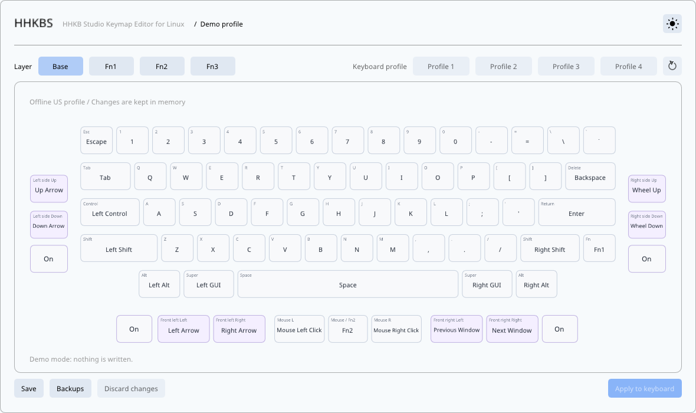

# HHKBS

Unofficial HHKB Studio keymap editor for the US layout on Linux.

<picture>
  <source media="(prefers-color-scheme: dark)" srcset="docs/images/hhkbs-main-dark.png">
  
</picture>

## Download

Download `hhkbs-<version>-linux-x86_64.tar.gz` from [GitHub Releases](https://github.com/07LEE/hhkbs/releases) and unpack it. Run `bin/hhkbs` from the unpacked folder; nothing needs to be installed except the device permissions below.

HHKBS needs a Linux x86_64 desktop with an X server (X11, or Wayland through XWayland) and OpenGL 3.0. Two programs it calls are optional: `fc-match` from Fontconfig, which finds the interface font, and `xdg-open`, which the Backups window uses to open its folder. Names in Korean are shown when a font that has Hangul is installed, for example Noto Sans CJK.

On a screen that shows everything larger, HHKBS follows the scale the desktop reports. Set `HHKBS_SCALE` (0.5 to 4) to choose another one, and `HHKBS_THEME` to `light` or `dark` to leave the desktop's colors alone.

## Device permissions

If HHKBS reports a permission error, use [60-hhkbs.rules](packaging/60-hhkbs.rules); it is also in the release archive, next to `bin`. Run these commands from the folder containing the file, then reconnect the keyboard:

```bash
sudo install -m 0644 60-hhkbs.rules /etc/udev/rules.d/60-hhkbs.rules
sudo udevadm control --reload-rules
sudo udevadm trigger
```

The rule gives the user who is logged in at the computer access to every interface of the HHKB Studio, not only the one HHKBS talks to. That includes the one that carries what is typed on it, so a program running as that user could read it. Over Bluetooth the keyboard has a single interface for everything. Install the rule only on a computer where that is acceptable.

## Usage

1. Connect the HHKB Studio over USB and open HHKBS. Over Bluetooth it can read the profile and switch the gesture pads; applying needs USB.
2. Choose a profile (1 to 4) and a layer, select a key, and assign a function. Each profile keeps its own edits.
3. Choose Apply to keyboard and pick the profiles to write. Save keeps the profile as a backup; Backups loads one back, and a dropped .toml file loads too.

Apply saves what the keyboard held to `~/.local/state/hhkbs/backups/` before writing. Do not unplug the keyboard while it is being written.

## Disclaimer

HHKBS is an unofficial project. It is not affiliated with or endorsed by PFU Limited, and HHKB and Happy Hacking Keyboard are trademarks of PFU Limited.

HHKBS writes to your keyboard. Use it at your own risk: the authors are not responsible for lost settings, a misbehaving keyboard, or any other damage caused by using it.

## License

[MIT](LICENSE). [Third-party licenses](third_party/README.md).
